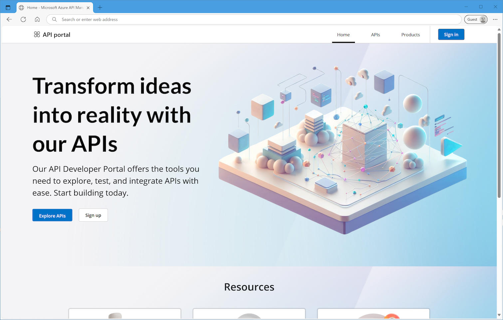

# Azure API Management developer portal

This repository is managed by the [Microsoft Azure API Management](https://aka.ms/apimrocks) team and contains the source code of the developer portal. Instructions for setting up and extending your self-hosted portal are located [in the wiki section](https://github.com/Azure/api-management-developer-portal/wiki).

If you're looking for **general information or documentation on the developer portal**, refer to the [official Azure documentation](https://aka.ms/apimdocs/portal). 

##  Releases

The `master` branch of this repository is used for daily development purposes and may contain unstable version of the software. We recommend using [releases](https://github.com/Azure/api-management-developer-portal/releases) for setting up your portal.

##  Interactions

You can **report bugs** or **submit feature requests** in [the repository's Issues section](https://github.com/Azure/api-management-developer-portal/issues).

Microsoft Azure Support assistance is limited to managed portals and only the initial setup of self-hosted portals ([documented in the Wiki](https://github.com/Azure/api-management-developer-portal/wiki/Self-hosting-the-portal)); best effort support is provided for problems that are caused by environmental factors, such as (but not limited to): hosting platform, development environment, network configuration. Other self-hosted portal assistance requests (for example, problem with custom widgets) should be submitted [on Stack Overflow](https://aka.ms/apimso) with the `azure-api-management` tag. **We don't provide support through GitHub Issues**.

We welcome and appreciate **[community contributions](CONTRIBUTIONS.md)**. Refer to the **[contribution guidelines](https://github.com/Azure/api-management-developer-portal/wiki/Widget-contribution-guidelines)** for more information.

##  License

The developer portal is based on our own fork of the [Paperbits framework](http://paperbits.io/), which we enriched with API Management-specific features, and is published under [MIT license](license).