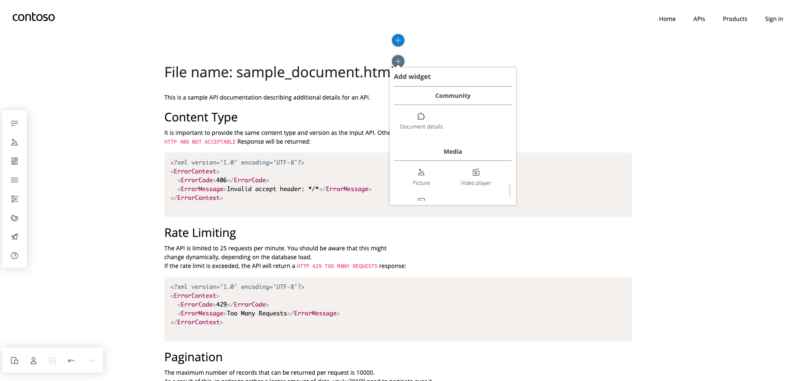
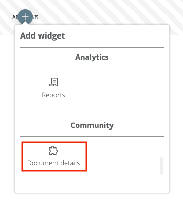
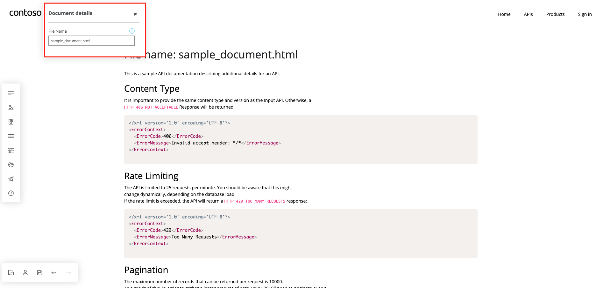
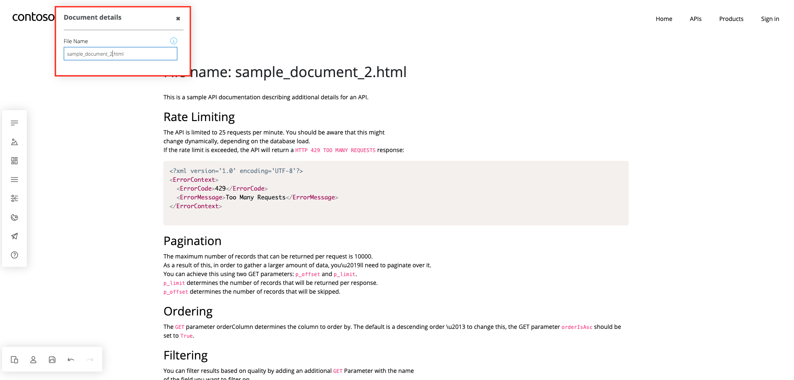
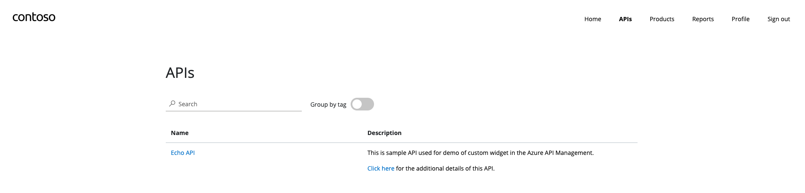
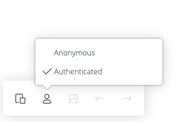
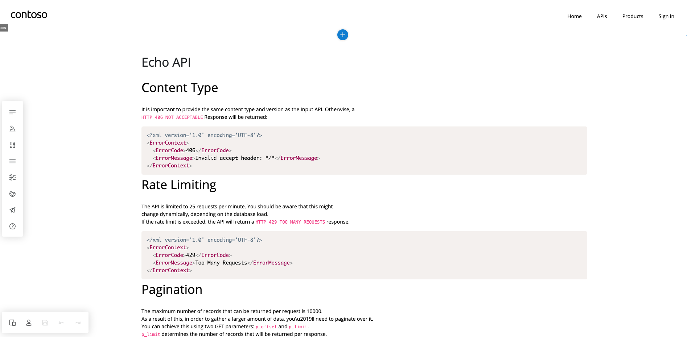

# Community widget: Document Session

**Contributor's GitHub alias**: Kanchan-Wakchaure

**Organization name**: Contoso



This widget retrieves the html document from the Azure storage account and displays it's content in the developer portal page.

## Scenario

Sometimes, API descriptions can be long enough including additional information such as Invocation pre-requisites Best practices, Security, Troubleshooting, Parameter values etc. These additional details can be displayed in a separate page in the developer portal.

## Solution

Additional details for the API are added to a HTML document and stored in the azure storage account. A custom widget (`Document details`) is added to page in the developer portal where this HTML document content is rendered. 

## Steps

### 1. Store the HTML documents in the Azure storage account
1. Store/Upload the html document containing additional details for an API into the azure storage account. 

1. Keep the access level of this document as either   
'Blob(anonymous read access for blobs only)' or 'Container(anonymous read access for containers and blobs)'.

### 2. Copy the widget 'document-details'
Copy the document-details folder from `/community/widgets` and paste in the `/api-management-developer-portal` folder

### 3. Update storage account url and default file name in the widget
1. Copy the URL for html document stored in your storage account and assign it to the constant `'documentApiUrl'` in `community/widgets/document-details/ko/runtime/document-details-runtime.ts`
1. Update the value of constant `defaultFileName` in `document-details/constants.ts` so that default content would be displayed in the portal when you add the widget. 

> **Note:** You can enter different file name in the editor once widget is added to the portal.

### 4. Register the widget
Register widget's modules in the portal's root modules by adding the following lines in the respective files:

1. `src/apim.design.module.ts` - a module that registers design-time dependencies.

    ```ts
    import { DocumentDetailsDesignModule } from "../community/widgets/document-details/documentDetails.design.module";

    ...

        injector.bindModule(new DocumentDetailsDesignModule());  
    ```

1. `src/apim.publish.module.ts` - publish-time dependencies.

    ```ts
    import { DocumentDetailsPublishModule } from "../community/widgets/document-details/documentDetails.publish.module";

    ...

        injector.bindModule(new DocumentDetailsPublishModule());
    ```

1. `src/apim.runtime.module.ts` - run-time dependencies.

    ```ts
    import { DocumentDetailsRuntimeModule } from "../community/widgets/document-details/documentDetails.runtime.module";
    
    ...

        injector.bindModule(new DocumentDetailsRuntimeModule()); 
    ```

### 5. Place the widget in the portal

You're now ready to use the document-details widget in the developer portal.

1. Execute the command `npm start`.
1. When the application loads, place the new widget on a page. You can find it under the name `Document details` in the `Community` category in the widget selector.

    

1. Save the page by pressing `Ctrl+S` (or `⌘+S` on Apple computers).

> **Note:** In design-time, you can still interact with the website by holding `Ctrl` (or `⌘`) key.

You would be able to see the default file content in the portal page.

### 6. Change the file name in the widget to load required content in the portal page. 
1. Select the document-details widget added to the page in the portal editor and click anywhere in the widget.
You can see the text-editor block in the corner where you can enter the required file name.

    

1.  Enter any file name (HTML document) stored in the storage account and it's content will be rendered in the page.

    


## Render the HTML document dynamically in the widget
In real-time scenario, user would usually go to API list page in the portal and then go through the description of API and its documentation details. 
In order to read the additional details for the API description in the portal, a link is provided in the API description which would redirect to additional details page in the same developer portal. The custom widget `Document details` is added to this page which would render the additional details for the respective API in the portal page.

    

### 1. Update link in the API description with following parameters:

1. Page name in the portal which would render the additional details(HTML file content from the storage account). 

1. Name of the file (HTML document stored in the storage account for the respective API)

For example: If a page `'documentation'` is created in the portal which would render the document `'sample_document.html'` for the API `'Echo API'` then the link in the description of 'Echo API' would be updated as follows:

```
<a href="documentation#fileName=sample_document.html&&api=Echo API">Click here</a> for the additional details of this API.

``` 
### 2. Add method `getFileName()` in `src/routing/routeHelper.ts` to get the file name dynamically in the portal

```
    /**
     * Returns ARM resource name of the html file specified in hash parameter of the current route, e.g. "sample_document.html".
     */
    public getFileName(): string {
        return this.getHashParameter("fileName");
    }
```

### 3. (Optional) Update the title in the documentation details page
If you want to replace the file name in documentation details page to API name, then replace the text variable `fileName` in the file `document-details/ko/runtime/document-details-runtime.html` to `api'.

```
<h1><span data-bind="text: api"></span></h1>
<p data-bind="html: sessionDescription"></p>

```

### 4. Run the application

1. To view the additional details for an API documentation, run the application with command as `npm start`.

1. Change the mode as 'Authenticated' in the portal editor to explore the APIs.

    

1. Click on the link given in any of the API description to see additional details in the documentation page.

    

