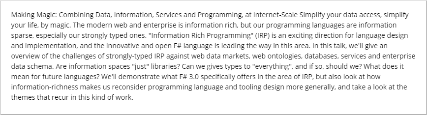

# Community widget: Conference Session

**Contributor's GitHub alias**: mikebudzynski

**Organization name**: Contoso

**Privacy and security notes**: This widget issues API calls to an external source.

This widget retrieves conference session information from the [Conference API](https://conferenceapi.azurewebsites.net/?format=json) and displays it on the portal. You can configure the session id through the widget editor.
